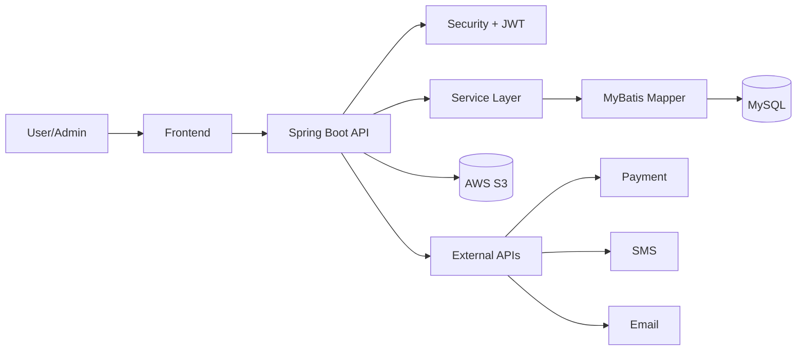

# MIDNEAR_BACKEND

MIDNEAR 커머스 서비스의 백엔드 API 서버입니다.  
상품 조회부터 주문/결제, 배송, 교환/반품, 리뷰, 관리자 운영까지 전체 커머스 플로우를 담당합니다.

## 목차

- [프로젝트 소개](#프로젝트-소개)
- [주요 기능](#주요-기능)
- [서비스 화면](#서비스-화면)
- [기술 스택](#기술-스택)
- [아키텍처](#아키텍처)
- [프로젝트 구조](#프로젝트-구조)
- [데이터베이스 설계](#데이터베이스-설계)
- [API 도메인](#api-도메인)
- [실행 방법](#실행-방법)
- [환경 변수](#환경-변수)

## 프로젝트 소개

| 항목 | 내용 |
| --- | --- |
| 기간 | 2024.11 ~ 2025.02 |
| 역할 | 백엔드 파트장 / PM |
| 팀 구성 | Backend 3 / Frontend 4 / Designer 1 |
| 핵심 스택 | Java 17, Spring Boot 3, MyBatis, MySQL, AWS, Jenkins |

## 주요 기능

- 상품/카테고리/옵션/재고 관리
- 장바구니/주문/결제/쿠폰/포인트 처리
- 배송지/배송 상태 관리
- 교환/반품/취소/구매확정 프로세스
- 리뷰/문의/공지/매거진 운영
- 관리자 콘솔(주문·배송·통계·고객지원)

## 서비스 화면

> 아래 이미지들은 `docs/images` 폴더에 업로드한 뒤 사용하세요.

### 메거진


### 상품 리스트


### 상품 상세


## 기술 스택

### Backend
- Java 17
- Spring Boot 3.4.1
- Spring Security, Spring Validation
- MyBatis 3.0.3
- JWT (jjwt 0.11.5)

### Database
- MySQL

### Infra / DevOps
- AWS (EC2, RDS, ALB, S3)
- Jenkins

### Tools
- Swagger (springdoc-openapi)
- log4jdbc

## 아키텍처



## 프로젝트 구조

```text
src/main/java/com/midnear/midnearshopping
├── config                  # Security/CORS/S3/Swagger
├── controller              # 사용자 API, 관리자 API
│   └── productManage       # 주문/배송/교환/반품/취소/구매확정 관리
├── service                 # 비즈니스 로직
│   ├── order               # 주문/결제
│   ├── product             # 상품
│   ├── productManagement   # 관리자 주문/배송/클레임
│   ├── delivery            # 배송지/배송정책
│   ├── review              # 리뷰
│   ├── inquirie            # 문의
│   ├── oauth               # 소셜 로그인
│   └── disruptive          # 이상 고객 관리
├── mapper                  # MyBatis Mapper Interface
├── domain
│   ├── dto                 # Request/Response DTO
│   ├── vo                  # DB 매핑 VO
│   └── enums               # 상태 enum
├── jwt                     # JWT 필터/유틸
└── exception               # 공통 예외 처리

src/main/resources
├── mapper                  # MyBatis XML
├── project.sql             # DB 스키마
├── logback.xml
└── log4jdbc.log4j2.properties
```

## 데이터베이스 설계

### 핵심 엔터티

- 사용자: `users`
- 상품: `products`, `product_colors`, `sizes`, `product_images`, `categories`
- 주문/결제: `orders`, `order_products`, `payments`
- 장바구니: `cart`, `cart_products`
- 쿠폰/포인트: `coupon`, `user_coupon`, `point`
- 배송: `delivery_address`
- 리뷰/문의: `reviews`, `review_images`, `inquiries`

### ERD


## API 도메인

- `User/Auth`: 회원가입, 로그인, JWT, OAuth2, 이메일/문자 인증
- `Product`: 상품 목록/상세, 카테고리, 색상/사이즈, 코디 상품
- `Order`: 주문 생성, 결제, 주문 조회
- `Claim`: 취소/교환/반품/구매확정
- `Delivery`: 배송지/배송정보 관리
- `Review`: 리뷰/리뷰 이미지
- `Admin`: 상품/주문/배송/통계/문의/공지/매거진 관리

## 실행 방법

### 요구사항
- JDK 17
- MySQL

### 실행

```bash
./gradlew clean build
./gradlew bootRun
```

## 환경 변수

```bash
DB_URL=
DB_USERNAME=
DB_PASSWORD=
JWT_SECRET=
AWS_ACCESS_KEY_ID=
AWS_SECRET_ACCESS_KEY=
AWS_REGION=
AWS_S3_BUCKET=
MAIL_USERNAME=
MAIL_PASSWORD=
COOLSMS_API_KEY=
COOLSMS_API_SECRET=
```

## 트러블슈팅/개선 포인트

- 관리자 콘솔 다중 조건 검색 안정화 (동적 쿼리 구조 정리)
- 주문/환불/포인트/쿠폰 처리 정합성 강화 (트랜잭션 경계 명확화)
- Jenkins 기반 배포 자동화로 운영 리드타임 단축

---

## 이미지 파일 배치 가이드

```text
docs/images/magazine.png
docs/images/shop-product-list.png
docs/images/product-detail.png
docs/images/midnear-db-schema.png
```
